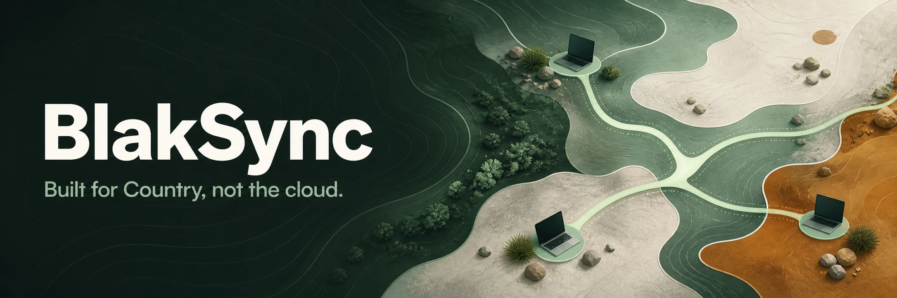
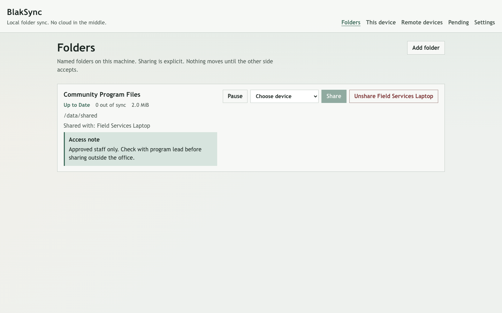
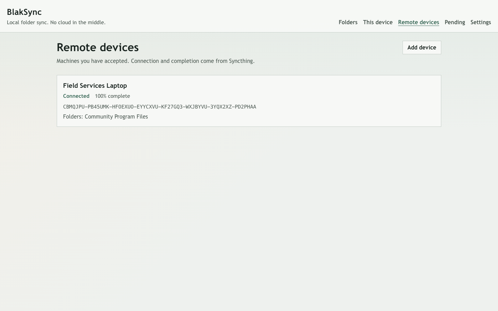

# BlakSync

[](https://github.com/yumaitau/BlakSync/actions/workflows/ci.yml)
[](https://github.com/yumaitau/BlakSync/actions/workflows/secret-scan.yml)

Peer-to-peer folder sync and sharing for Australian Indigenous organisations.
Devices talk to each other. There is no Dropbox, iCloud, or OneDrive in the middle. Built for Country, not the cloud.

Public repo: https://github.com/yumaitau/BlakSync

The earlier clone at https://github.com/jusso-dev/BlakSync is archive-only.

## Interface

Current interface shown with representative state from a verified two-node container test on the homelab: a paired field laptop, a 2.0 MiB folder, matching synced files, and no cloud service in the middle.





## Why it exists

Louis Gleeson posted about [Syncthing](https://syncthing.net) as a $0 replacement for cloud drive subscriptions. That model is right: devices connect directly, transfers are TLS with perfect forward secrecy, each device has a certificate, nothing moves without permission.

BlakSync is that idea aimed at Indigenous orgs. Same engine (Syncthing, Apache-2.0), plus org tenancy, cultural access notes, and a quieter UI. We do not reimplement the Block Exchange Protocol in v1.

Source for the tweet: https://x.com/aigleeson/status/2091102436438188479
Upstream: https://github.com/syncthing/syncthing

## What v1 does

- Target Windows, macOS, and Linux with the Rust wrapper. Pair Syncthing-compatible peers with a device ID and an explicit share.
- Sync named folders (photos, work docs, heritage scans) continuously when devices are online.
- No account, no subscription, and no vendor-controlled copy of the files.
- Org profile, roles, and an access note on each shared folder.
- Local web GUI plus a CLI. Discovery via local LAN and optional global discovery the org can turn off.
- Self-hosted CI on `runs-on: [self-hosted, linux]`.

## What v1 does not do

- Not a browser-only drop-a-file link (that was a wrong first cut).
- Not a public cloud bucket.
- No claim this replaces a legal cultural heritage register.

## Stack

- Syncthing as the unchanged peer-to-peer sync engine
- One Rust application binary for the CLI, local API, launcher, org config, access notes, and audit
- A separate Rust secret-scanner binary used locally and in CI
- React/Vite for the browser interface; Node.js is build-time only and is not a backend runtime
- No Python runtime
- Local web GUI on `127.0.0.1` (Syncthing's own GUI stays as fallback)
- Apache-2.0 to match Syncthing

## Install and start Syncthing

Install Rust 1.85 or newer. Node.js 22 or newer is needed only when building the React GUI. Syncthing does not have to be on `PATH`. Install the pinned build (currently 2.1.3) into the config `bin` directory or next to `blaksync`:

```sh
bash scripts/install-syncthing.sh "$HOME/.config/blaksync/bin"
```

See [docs/syncthing-pin.md](docs/syncthing-pin.md) to bump the pin. `blaksync --version` prints it. `blaksync start` refuses an unsupported major version.

Build the Rust backend and GUI, then start Syncthing under BlakSync's dedicated config directory:

```sh
cargo build --release --locked
npm ci
npm run build
./target/release/blaksync start
```

On first run, the wrapper generates the platform config directory (`~/.config/blaksync` on Linux), prints the local GUI URL and certificate-derived device ID, then runs Syncthing in the foreground. The GUI is forced to `127.0.0.1:8384`. Stop with Ctrl-C. Override binary or config location when needed:

```sh
./target/release/blaksync start --syncthing /opt/syncthing --home /srv/blaksync/config
```

Global discovery and relays keep Syncthing's defaults. LAN discovery works without internet access. To keep metadata off global discovery or run Tailscale-only, change Syncthing's connection settings as described in [the threat model](docs/threat-model.md) and [office-node guide](docs/office-node.md).

For development, `cargo run -- start` runs the same command without installing the binary.

## Local web GUI

Build once, then start the BlakSync GUI. It binds to `127.0.0.1:8385` by default and reads the Syncthing API key from `config.xml` after `start`. You do not export `BLAKSYNC_API_KEY` on a field laptop. The environment variable remains for tests. No third-party analytics. No CDN fonts.

```sh
npm ci
npm run build
./target/release/blaksync gui
```

`blaksync gui --tls` serves HTTPS with `https-cert.pem` / `https-key.pem` in the config directory. HTTP on that port is then refused. The GUI still refuses a non-localhost bind.

Open http://127.0.0.1:8385. Pages cover Folders, This device, Remote devices, Pending, Health, Audit, Settings, and Privacy. The first run is a wizard: organisation, `Australia/*` timezone, device name, and discovery. From Folders you can add a folder (with an access note), share it, pause, or unshare. Unshare leaves files already received. Pending shows access notes before Accept or Deny. Members cannot accept or share.

For local frontend work without rebuilding:

```sh
# terminal 1 — Rust API (also serves dist/ when present)
cargo run -- gui
# terminal 2 — Vite on 127.0.0.1:5173, proxies /api
npm run dev
```

## Pair and share from the CLI

Requires the running Syncthing instance started above. BlakSync controls Syncthing through its local REST API; it does not proxy or store files. After `start`, commands read `<apikey>` from the dedicated `config.xml`. The key is never printed. `BLAKSYNC_API_KEY` remains as a test override:

```sh
# Optional when the local GUI is not at the default address:
export BLAKSYNC_URL='http://127.0.0.1:8384'
./target/release/blaksync device-id
```

The reported ID is the certificate-derived Syncthing device ID. BlakSync does not create another identity. Device-to-device data uses Syncthing's authenticated TLS transport with perfect forward secrecy.

Pairing is mutual. On machine A, show the ID and add B; on machine B, show the ID and add A:

```sh
./target/release/blaksync device-id
./target/release/blaksync add-device --device DEVICE_ID_FROM_THE_OTHER_MACHINE --name 'Other machine'
```

`pending-devices` shows devices that have contacted this instance but have not been accepted. Adding a device does not share any folder. The default `dynamic` address uses both LAN discovery (which works without internet access) and, when enabled in Syncthing, global discovery. Syncthing's optional relay remains available when NAT prevents a direct connection; relays carry end-to-end encrypted traffic and cannot read folder contents.

Create and explicitly offer a folder on A:

```sh
mkdir -p "$PWD/sync-test"
./target/release/blaksync add-folder --folder sync-test --path "$PWD/sync-test" --label 'Sync test' \
  --note 'Speak with the cultural officer before pairing a new device.'
./target/release/blaksync share --folder sync-test --device DEVICE_ID_OF_B
```

The same flow works in the BlakSync GUI without opening Syncthing's stock UI.

Nothing is copied to B until B accepts the offered folder ID and chooses a local path:

```sh
mkdir -p "$PWD/sync-test"
./target/release/blaksync accept-folder --folder sync-test --path "$PWD/sync-test" --device DEVICE_ID_OF_A --label 'Sync test'
./target/release/blaksync status
```

Status is reported as `Preparing`, `Syncing`, `Up to Date`, `Unshared`, or `Paused`. Folder controls are:

```sh
./target/release/blaksync pause --folder sync-test
./target/release/blaksync resume --folder sync-test
./target/release/blaksync unshare --folder sync-test --device DEVICE_ID_OF_B
```

Unsharing removes that device from the folder and stops subsequent updates. It does not erase files already received.

## Manual two-device acceptance test

1. Start Syncthing with `blaksync start` on two machines. Confirm `device-id` returns the same ID shown by Syncthing. No API key export is required after `start`. CI also runs `scripts/e2e-two-device.sh` on the self-hosted runner.
2. Run `add-device` on both machines. Confirm a third, unaccepted Syncthing device is absent from `devices` and cannot list or request `sync-test`.
3. Add and share `sync-test` on A. Confirm B reports the offer but receives no files before `accept-folder` is run on B.
4. On A, create a 100 MiB test file without uploading it anywhere: `dd if=/dev/urandom of=sync-test/payload.bin bs=1M count=100 status=progress`.
5. Wait until `blaksync status` says `Up to Date` on both machines. Run `sha256sum sync-test/payload.bin` on both and confirm the checksums match.
6. Run `unshare` on A, then create another file on A. Confirm it does not appear on B. Re-share, test `pause` and `resume`, and confirm updates stop while paused and continue after resume.

Automated Rust tests cover the org boundary, access notes, launcher contract, secret detection, and local HTTP security policy without publishing folder contents or API keys:

```sh
cargo test --all-targets --all-features --locked
```

## What never goes in git

These are device identity or live config. They stay on the device. `.gitignore` already lists them; CI still scans so a force-add does not sneak through.

| File | Why |
| --- | --- |
| `cert.pem` / `key.pem` | Device identity. Anyone with `key.pem` can impersonate the device and pull every folder it can see. |
| `https-cert.pem` / `https-key.pem` | GUI TLS material. |
| `config.xml` | Folder paths, paired device IDs, and the GUI **API key** (`<apikey>`). |
| `.env` and anything with API keys or tokens | Same class of secret. Use `.env.example` with empty values if you must document names. |

Do not commit a copy "just for the office node backup". Copy those files onto the office disk with the same permissions you would give the live process, not into this repository.

If one of those files lands in git: treat it as leaked, revoke or rotate ([docs/threat-model.md](docs/threat-model.md)), and scrub history with a maintainer. Deleting it in a follow-up commit is not enough.

## Threat model and a lost laptop

Syncthing has no central file store. The realistic failures are a pairing mistake, a leaked `key.pem`, discovery/relay metadata, and an unlocked office node or laptop.

Read [docs/threat-model.md](docs/threat-model.md) before treating a device as gone. Copy-paste revoke and rotate steps live there. Honest limits in short:

- **Metadata** — file bytes on the wire are encrypted; device IDs, IPs (via global discovery), and folder/file names among peers are not a secret from the services that make pairing work.
- **Online requirement** — if every copy is offline, nobody can pull. An office node is an always-on disk, not a cloud.
- **Unlocked disk** — there is no at-rest encryption from Syncthing. Full-disk encryption is the org's job.

## Secret scan (self-hosted)

Pull requests and pushes run the Rust history scanner and Gitleaks on `runs-on: [self-hosted, linux]`. The runner scans the tree locally. Nothing is uploaded to a SaaS secret scanner.

A dummy `key.pem` committed on a test branch must fail that job. Locally:

```bash
cargo run --locked --bin blaksync-secret-scan -- --source .
bash scripts/assert-dummy-key-fails.sh
```

## Org overlay

Syncthing has no organisation concept. BlakSync adds a local overlay in one config directory: org profile, roles, a free-text access note on each folder, a pending-device prompt, and a local audit log. The organisation writes the note. BlakSync does not invent ceremony rules.

Each config directory is one organisation. Two config directories cannot see each other's folders. There is no social login. Government ID is not stored.

Roles:

- **owner** — set the org profile, assign roles, accept devices, share folders
- **admin** — accept devices, share folders, write access notes
- **member** — sync accepted folders; cannot accept a new device

Default config directory: `--config-dir` or `BLAKSYNC_CONFIG_DIR`, otherwise the platform config directory (`~/.config/blaksync` on Linux).

```sh
./target/release/blaksync org init \
  --name "Example Land Council" \
  --timezone Australia/Darwin \
  --contact it@example.org.au \
  --actor-id office-node \
  --actor-name "Office node"

./target/release/blaksync org folder-add \
  --id heritage-scans \
  --label "Heritage scans" \
  --note "Speak with the cultural officer before pairing a new device."

./target/release/blaksync org pending
./target/release/blaksync org accept --device DEVICEID
./target/release/blaksync org share --folder heritage-scans --device DEVICEID
./target/release/blaksync org unshare --folder heritage-scans --device DEVICEID
./target/release/blaksync org audit-export
```

Timezone must be an `Australia/*` IANA name. The pending prompt shows the org name, folder labels, who may pair, and the access note before Accept. Members who run `accept` still see the note, then the command fails.

The audit CSV columns are `timestamp,event,actor,role,device_id,folder_label`. Events include `device_accepted`, `folder_shared`, `folder_unshared`, `device_revoked`, and `role_changed`. Paths and file contents are not recorded. Only an owner can assign roles. An admin cannot create a new owner. The last owner cannot demote themselves.

Backup the office-node config onto org-owned disk or a USB drive, never into this repository:

```sh
./target/release/blaksync backup --out /media/org-usb/blaksync
./target/release/blaksync restore --from /media/org-usb/blaksync
```

```sh
cargo test --all-targets --all-features --locked
```

## Office node

See [the office node guide](docs/office-node.md) for the org-owned disk layout, reboot-safe systemd service, Windows WinSW service, health page, and optional Tailscale-only transport.

Printed office copy: [pairing card](docs/pairing-card.md), [office SOP](docs/office-sop.md), and [privacy notice](docs/privacy.md). Release cuts follow [docs/release.md](docs/release.md).

## Licence

Apache License 2.0, same as Syncthing. See [LICENSE](LICENSE).

## Contributing

See [CONTRIBUTING.md](CONTRIBUTING.md). Never commit Syncthing API keys, device private keys, or `.env` files containing real secrets.
